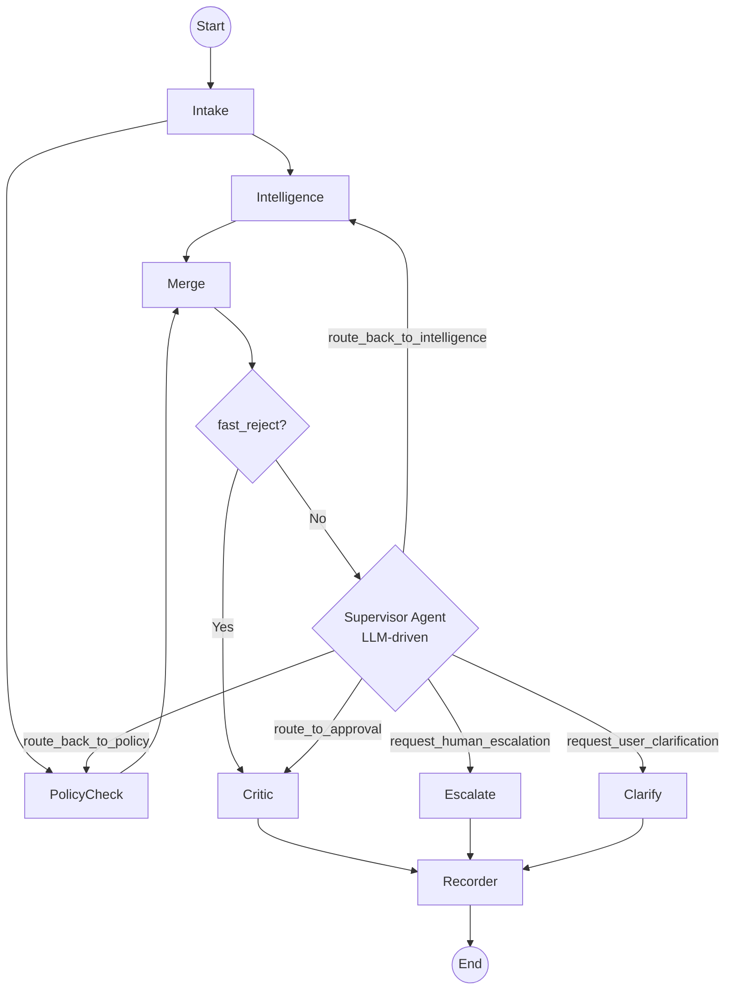

# Orion Workflow — Current Implementation Guide

This document describes the execution flow as actually implemented in `app/graph.py`.

---

## Graph Topology



> **Loop guard:** `supervisor_visits` increments each time the Supervisor node
> runs. At `supervisor_visits >= 3`, the LLM call is skipped and the graph forces
> `request_human_escalation` regardless of accumulated state.

---

## Step-by-Step Breakdown

### 1. Intake

**File:** `app/agents/intake.py`

**Trigger:** `POST /api/submit` with a `ReimbursementSubmission` payload.

**Action:**
1. `extract_largest_amount()` scans `receipt_text` for currency tokens (RM, MYR, USD, etc.)
   and records the largest value as `regex_extracted_amount`.
2. If the regex amount diverges from the LLM-extracted amount by >20%, `confidence`
   is forced below `0.6`.
3. `chat_structured()` parses the free-text into a full `IntakeClaim`.

**Output:** `state["intake"]` — an `IntakeClaim`.

---

### 2. Intelligence + Policy (Parallel)

After Intake, `intelligence` and `policy_check` run **in parallel** as separate
LangGraph branches. This cuts per-claim latency by approximately 23–42%.

#### 2a. Intelligence (Tool-Calling Loop)

**File:** `app/agents/intelligence.py`

**Trigger:** Always runs after Intake. Also triggered by Supervisor's
`route_back_to_intelligence`.

**Action:** Runs an autonomous tool-calling loop (max 5 iterations). All four
tools return pre-computed signals so the LLM narrates without doing math:

1. `search_ledger_by_amount(amount, tolerance_pct, employee_id)` — finds past claims near the same MYR value; returns `duplicate_signals`
2. `search_ledger_by_merchant(merchant_name, employee_id)` — finds past claims from the same vendor; returns `vendor_signals`
3. `search_employee_history(employee_id, days_back)` — checks the employee's recent claim history; returns `anomaly_signals` including z-score and spike flag
4. `lookup_subscription_catalog(merchant_name)` — checks org licenses and approved vendor catalog

A final `chat_structured()` call synthesises all evidence into the structured report.

**Output:** `state["intelligence"]` — an `IntelligenceReport`.

#### 2b. Policy Check (Deterministic Python)

**Defined in:** `app/graph.py` (`policy_check_node`) calling `app/tools/policy_engine.py`

**Trigger:** Always runs after Intake (parallel to Intelligence). Also triggered by
Supervisor's `route_back_to_policy`.

**Action:** Pure Python evaluation of hard rules — zero LLM calls:
- POL-004: business justification length
- POL-005: category in approved list
- POL-007: receipt required for amounts > MYR 100
- POL-008: soft flag for monthly billing > MYR 200
- Amount-tier routing hints computed here

**Output:** `state["policy"]` — a `PolicyReport`.

---

### 3. Merge + Fast-Reject Route

**Node:** `merge_intel_policy` in `app/graph.py`

Fan-in passthrough after both parallel branches complete. Reconciles POL-006:
if Intelligence flagged `is_likely_duplicate=True`, ensures the Policy report
reflects a duplicate hard violation and sets `fast_reject=True`.

**Routing (`_fast_reject_route`):**
- `policy.fast_reject=True` → **Critic** (short-circuit, skips Supervisor)
- Otherwise → **Supervisor**

The fast-reject path saves ~7 seconds per hard-violation claim.

---

### 4. Supervisor (LLM-Driven Routing)

**File:** `app/agents/supervisor.py`

**Trigger:** Runs after `merge_intel_policy` when no fast-reject. May run again
if a loop-back route was taken.

**Action:** Single LLM call at `temperature=0.0`. Reviews the full accumulated
state and chooses one of five routes (see graph above). Emits `reasoning`,
`focus_areas`, and (on clarification route) `clarification_questions`.

**Hard guard:** If `supervisor_visits >= 3`, the LLM is bypassed and the node
emits `request_human_escalation` directly.

**Output:** `state["supervisor"]` — a `SupervisorDecision`.

---

### 5a. Critic (via `route_to_approval` or fast-reject)

**File:** `app/agents/critic.py`

**Action:** Adversarial single LLM call. Tries to find the strongest rejection
argument. Only emits `auto_approve` when no defensible counter-argument exists.

Possible decisions: `auto_approve`, `auto_reject`, `escalate_manager`,
`escalate_finance`, `request_info`.

Amount thresholds are prompt guidance (≤ MYR 500 → auto-approve eligible,
> MYR 5000 → finance escalation), not hard branches.

---

### 5b. Loop-Backs

**Via `route_back_to_intelligence`:** State returns to the Intelligence node.
`retry_count` increments. Intelligence re-runs its tool-calling loop; it has
the same claim context but can explore different tools or go deeper.

**Via `route_back_to_policy`:** State returns to the `policy_check` node.
Useful when new context (e.g., Supervisor identified a previously unknown
ambiguity) changes which hard rules apply.

---

### 5c. Human Escalation (via `request_human_escalation`)

**Node:** `escalate_node` in `app/graph.py`

Packages the Supervisor's `reasoning` as an `escalate_manager` `ApprovalOutcome`.
No LLM call. Proceeds directly to Recorder.

---

### 5d. User Clarification (via `request_user_clarification`)

**Node:** `clarify_node` in `app/graph.py`

Packages `SupervisorDecision.clarification_questions` as a `request_info`
`ApprovalOutcome`. No LLM call. The graph terminates; the API response includes
the questions for the frontend to display. The employee must resubmit with the
requested details.

---

### 6. Recorder

**File:** `app/agents/recorder.py`

Deterministic — no LLM. Writes a `LedgerRecord` to `data/ledger.json` and
sets `state["terminal"] = True`.

Notification list built from decision type:
- `auto_approve` → employee + `role:finance_ops`
- `escalate_manager` → employee + `role:direct_manager`
- `escalate_finance` → employee + `role:finance_controller`
- `auto_reject` → employee only

---

## State Accumulation

Each node reads from and writes back to the `WorkflowState` TypedDict:

```
WorkflowState
├── claim_id: str
├── submission: ReimbursementSubmission    ← API input
├── submission_hash: str                   ← SHA-256 for idempotency dedup
├── intake: IntakeClaim                    ← set by Intake
├── intelligence: IntelligenceReport       ← set by Intelligence (may update on loop-back)
├── policy: PolicyReport                   ← set by policy_check (may update on loop-back)
├── supervisor: SupervisorDecision         ← set by Supervisor (updates each pass)
├── approval: ApprovalOutcome              ← set by Critic, clarify_node, or escalate_node
├── record: LedgerRecord                   ← set by Recorder
├── retry_count: int                       ← incremented on loop-backs
├── supervisor_visits: int                 ← hard termination counter (forces escalation at ≥3)
├── terminal: bool                         ← set True by Recorder
├── error: Optional[str]
└── trace: list[str]                       ← ordered node visit log (reducer: operator.add)
```

The `trace` field collects entries like `"intelligence(iters=3)"` and
`"supervisor:route_to_approval"` so the frontend can show exactly which
path was taken. The `operator.add` reducer allows parallel nodes to each
append without conflict.

---

## LLM Call Budget (per claim, typical)

| Node | LLM Calls |
|---|---|
| Intake | 1 |
| Intelligence | 1 loop (≤5 tool turns) + 1 synthesis = up to 6 |
| Policy Check | 0 (Python) |
| Supervisor | 1 (or 0 if visits ≥ 3) |
| Critic | 1 |
| clarify_node / escalate_node | 0 (Python) |
| Recorder | 0 (Python) |
| **Typical total** | **~4–5 LLM calls** |
