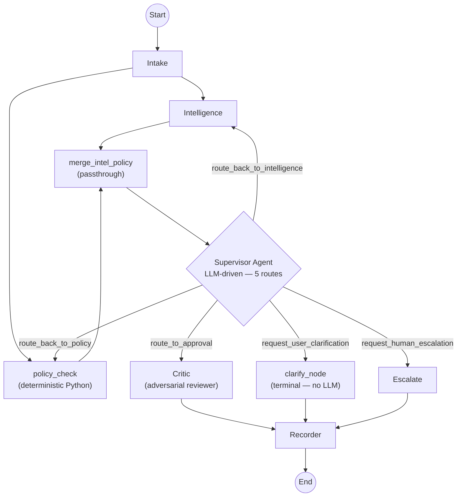

# Orion Workflow — v2 Plan

This document describes the **target execution flow** after all P1 and P2 changes are applied.
The current (v1) workflow is described in `docs/workflow.md`.

---

## Graph Topology (v2)



> **Loop guard (hard):** `supervisor_visits` is incremented on every Supervisor node entry.
> At `supervisor_visits >= 3`, the LLM is bypassed and the graph forces `request_human_escalation`.
> This guarantees termination — demo can never hang indefinitely.

---

## Key Changes from v1

### DELETED: Validation Node and `request_info` Node

The Validation agent had no viable "resume" mechanism without session persistence.
Its function is absorbed by:
1. **Supervisor `request_user_clarification` route** — terminates graph with structured questions
2. **Intake upstream detection** — `missing_fields`, `confidence < 0.6`, `regex_extracted_amount` mismatch
3. **Policy engine `ambiguous_flags`** — `"low_intake_confidence"` flagged deterministically

**Removed from graph.py:**
- `validation` node
- `request_info` node
- `_post_validation_route` conditional edge function
- `_guard_loop` helper function (replaced by single `supervisor_visits` ceiling — see below)

### ADDED: Parallel Intelligence + Policy Check

After `intake`, both `intelligence` and `policy_check` run simultaneously:

```python
# graph.py — build_graph()
g.add_edge("intake", "intelligence")
g.add_edge("intake", "policy_check")          # parallel branch
g.add_edge("intelligence", "merge_intel_policy")
g.add_edge("policy_check", "merge_intel_policy")
g.add_edge("merge_intel_policy", "supervisor")  # default path
# fast-reject short-circuit (Q7)
g.add_conditional_edges(
    "merge_intel_policy",
    _fast_reject_route,
    {"critic": "critic", "supervisor": "supervisor"},
)
```

`_fast_reject_route` checks `state["policy"].fast_reject`. If `True`, routes directly to `critic` (which will `auto_reject`), bypassing Supervisor entirely. Saves 2 LLM calls on hard policy violations. Pitch: *"Hard violations short-circuit the LLM router — the rules engine decided, not the model."*

**`merge_intel_policy` also reconciles POL-006 (Q8):** Because `policy_check` runs in parallel with `intelligence`, it cannot read `state["intelligence"]` during its first pass (race condition). The merge node runs `_reconcile_pol006()` after both branches complete:

```python
def _reconcile_pol006(state: WorkflowState) -> WorkflowState:
    """Inject synthetic POL-006 violation if Intelligence flagged duplicate but Policy didn't."""
    intel = state.get("intelligence")
    policy = state.get("policy")
    if intel and intel.is_likely_duplicate and policy:
        already_flagged = any(v.rule_id == "POL-006" for v in policy.hard_violations)
        if not already_flagged:
            policy.ambiguous_flags.append(
                "POL-006: duplicate_subscription_suspected — reconciled from Intelligence report"
            )
    return state
```

This keeps `policy_check` stateless and fast. Supervisor receives clean, reconciled state. Fully deterministic and unit-testable in isolation.

**Wall-clock latency savings:** ~7 seconds (Policy LLM call ~4s eliminated from critical path; full path now gated by Intelligence ~15s in parallel).

### REMOVED: `_guard_loop` Helper

`_guard_loop(state, target)` has been **deleted**. It was a per-target soft ceiling that could never fire before the global `supervisor_visits >= 3` hard cap. Two ceilings with different scopes create confusion about which fires first.

**One ceiling, clearly placed:** `supervisor_visits >= 3` in `supervisor_node` is the sole termination guard. It runs before any LLM call. If it trips, escalation is deterministic.

### RENAMED: `approval` → `critic`

Node renamed from `approval_node` to `critic_node`.
Agent file renamed from `approval.py` to `critic.py`.
Prompt reframed to adversarial: "Try to reject. Approve only if you cannot."

### ADDED: `clarify_node` (replaces `request_info_node`)

```python
@traceable(run_type="chain", name="agent.clarify")
def clarify_node(state: WorkflowState) -> WorkflowState:
    """Package Supervisor's clarification questions as a REQUEST_INFO terminal outcome."""
    sup = state.get("supervisor")
    questions = sup.clarification_questions if sup else []
    outcome = ApprovalOutcome(
        decision=ApprovalDecision.REQUEST_INFO,
        approver_role=None,
        reason="Clarifications required before a decision can be made.",
        confidence=0.9,
        next_action="Questions: " + " | ".join(questions),
    )
    trace = state.get("trace", []) + ["clarify"]
    return {**state, "approval": outcome, "trace": trace}
```

---

## Step-by-Step Breakdown (v2)

### 1. Intake

**File:** `app/agents/intake.py`

**Trigger:** `POST /submit` with `ReimbursementSubmission`.

**New in v2:**
1. `extract_largest_amount(receipt_text)` regex pass runs before the LLM call (`app/tools/amount_extractor.py`).
2. Both `regex_extracted_amount` and `claimed_amount` injected into the Intake prompt.
3. If divergence > 20% → `confidence < 0.6` + note added.
4. Digital PDFs only — no vision fallback (see README for limitation).

**Output:** `state["intake"]` — `IntakeClaim` (now includes `regex_extracted_amount`, `vision_extracted`).

---

### 2. Intelligence + Policy Check (PARALLEL)

Both nodes start simultaneously after Intake completes.

#### 2a. Intelligence (Tool-Calling Loop)

**File:** `app/agents/intelligence.py`

**No change to loop structure.** Changes are in the tools it calls:
- `search_employee_history` now returns `anomaly_signals` with z-score and spike flag
- `search_ledger_by_amount` now returns `duplicate_signals`
- `search_ledger_by_merchant` now returns `vendor_signals`

The synthesis prompt is updated:
> "Tools have pre-calculated statistical signals. Narrate the findings using `anomaly_signals`, `duplicate_signals`, and `vendor_signals` directly. Do not recalculate."

**Output:** `state["intelligence"]` — `IntelligenceReport`

#### 2b. Policy Check (Deterministic — NO LLM)

**File:** `app/tools/policy_engine.py` called from a thin graph node `policy_check_node`

```python
# graph.py (new node)
@traceable(run_type="chain", name="agent.policy_check")
def policy_check_node(state: WorkflowState) -> WorkflowState:
    claim = state["intake"]
    receipt_text = state["submission"].receipt_text
    is_dup = state.get("intelligence", {}).get("is_likely_duplicate", False) \
             if state.get("intelligence") else False

    result = evaluate_hard_rules(claim, receipt_text, is_dup)

    policy_report = PolicyReport(
        compliant=not result.fast_reject,
        applied_rules=["POL-001","POL-002","POL-003","POL-004","POL-005","POL-007","POL-008"],
        hard_violations=result.hard_violations,
        ambiguous_flags=result.ambiguous_flags,
        fast_reject=result.fast_reject,
        violations=result.hard_violations,
        summary=f"{'FAST REJECT' if result.fast_reject else 'No hard violations'}. "
                f"{len(result.ambiguous_flags)} soft flags for Supervisor.",
    )
    trace = state.get("trace", []) + [f"policy_check(violations={len(result.hard_violations)})"]
    return {**state, "policy": policy_report, "trace": trace}
```

> **Note on POL-006 (duplicate subscription):** `policy_check` runs in parallel with `intelligence` and cannot read `state["intelligence"]`. POL-006 is therefore *not evaluated* in `policy_check_node` — it is reconciled deterministically in `merge_intel_policy_node` after both branches complete (see merge step below).

**Output:** `state["policy"]` — `PolicyReport`

---

### 3. Merge (Passthrough)

**New node:** `merge_intel_policy`

Two responsibilities:

1. **Fan-in passthrough** — ensures both `state["intelligence"]` and `state["policy"]` are written before Supervisor reads state.
2. **POL-006 reconciliation** — if `intelligence.is_likely_duplicate=True` and no POL-006 violation exists in `policy.hard_violations`, injects a synthetic POL-006 flag into `policy.ambiguous_flags`. Deterministic, testable in isolation. Supervisor receives clean state; no conditional LLM logic needed.

```python
@traceable(run_type="chain", name="agent.merge")
def merge_intel_policy_node(state: WorkflowState) -> WorkflowState:
    """Fan-in: reconcile POL-006 after parallel branches complete."""
    intel = state.get("intelligence")
    policy = state.get("policy")
    if intel and intel.is_likely_duplicate and policy:
        already_flagged = any(v.rule_id == "POL-006" for v in policy.hard_violations)
        if not already_flagged:
            policy.ambiguous_flags.append(
                "POL-006: duplicate_subscription_suspected — see intelligence.duplicate_matches"
            )
    return state
```

**After merge — fast-reject short-circuit:** A conditional edge reads `state["policy"].fast_reject`. If `True` (any block violation fired), routes directly to `critic` node which emits `auto_reject`. Supervisor is bypassed. Saves ~4s (Supervisor LLM) + ~3s (Critic LLM is still called but will trivially reject).

```python
def _fast_reject_route(state: WorkflowState) -> str:
    policy = state.get("policy")
    if policy and policy.fast_reject:
        return "critic"  # short-circuit — no Supervisor needed
    return "supervisor"
```

---

### 4. Supervisor (LLM-Driven, 5 Routes + Hard Guard)

**File:** `app/agents/supervisor.py`

**Input:** Full `WorkflowState` including `intelligence`, `policy` (with `ambiguous_flags`).

**5 routes (Validation route removed):**

| Route | Meaning |
|---|---|
| `route_to_approval` | Fast-path or clear decision → Critic |
| `route_back_to_intelligence` | Intelligence report is shallow; re-investigate |
| `route_back_to_policy` | New context changes which hard rules apply |
| `request_human_escalation` | Genuinely ambiguous; human must decide |
| `request_user_clarification` | Missing information; return structured questions, end graph |

**`SupervisorDecision` schema (updated):**
```python
class SupervisorDecision(BaseModel):
    route: SupervisorRoute
    reasoning: str
    focus_areas: list[str] = []
    clarification_questions: list[str] = Field(
        default_factory=list,
        description="Populated only when route=request_user_clarification. Max 3 questions."
    )
```

**Prompt additions:**
1. Include `policy.ambiguous_flags` — soft flags from deterministic engine
2. Include `intake.regex_extracted_amount` vs `intake.amount_myr` for cross-check
3. Include `intake.confidence` — low confidence → consider `request_user_clarification`
4. Include `supervisor_visits` — so the LLM knows it's in a loop (can self-route to escalation)

**Hard bypass (guaranteed termination):**
```
if supervisor_visits >= 3 → force request_human_escalation, NO LLM CALL
```

---

### 5. Routing Decision

```python
def _supervisor_route(state):
    sup = state.get("supervisor")
    route_map = {
        SupervisorRoute.route_to_approval:            "critic",
        SupervisorRoute.route_back_to_intelligence:   "intelligence",  # supervisor_visits guard fires first
        SupervisorRoute.route_back_to_policy:         "policy_check",
        SupervisorRoute.request_human_escalation:     "escalate",
        SupervisorRoute.request_user_clarification:   "clarify",
    }
    return route_map.get(sup.route, "critic")
```

> **No `_guard_loop` calls.** The `supervisor_visits >= 3` check in `supervisor_node` fires *before* the LLM runs and before this routing function is reached. By the time `_supervisor_route` is called, the loop is already guaranteed not to exceed the ceiling. One guard, one place.

---

### 5a. Critic (via `route_to_approval`)

**File:** `app/agents/critic.py` (renamed from `approval.py`)

**Framing change:** Adversarial reviewer.

Prompt addition:
> "Your job is to **find the strongest reason to REJECT this claim**. Search for inconsistencies, policy violations, and risk signals. Only approve if you cannot construct a defensible counter-argument. This adversarial stance is a financial control, not a bias."

**Output:** `ApprovalOutcome` — same schema, same decision enum values.

---

### 5b. Clarify Node (via `request_user_clarification`)

Packages `SupervisorDecision.clarification_questions` as `ApprovalOutcome(REQUEST_INFO)`.
No LLM call. Terminates the graph.

---

### 5c. Escalate Node (via `request_human_escalation`)

Unchanged from v1 — packages Supervisor reasoning as `ESCALATE_MANAGER`.

---

### 5d. Loop-Backs

**Via `route_back_to_intelligence`:** Goes back to `intelligence` node. `retry_count` increments. Hard guard: `supervisor_visits >= 3` prevents this branch from executing.

**Via `route_back_to_policy`:** Goes back to `policy_check` node (deterministic). Very fast — no LLM call.

---

### 6. Recorder

**File:** `app/agents/recorder.py`

**UNCHANGED.** Receives `ApprovalOutcome` from any of: Critic, Clarify, Escalate.

---

## State Accumulation (v2)

```
WorkflowState (v2)
├── claim_id: str
├── submission: ReimbursementSubmission
├── intake: IntakeClaim                    ← Intake (now includes regex_extracted_amount)
├── intelligence: IntelligenceReport       ← Intelligence (may update on loop-back)
├── policy: PolicyReport                   ← policy_check node (deterministic, no LLM)
├── supervisor: SupervisorDecision         ← Supervisor (now has clarification_questions)
├── approval: ApprovalOutcome              ← Critic, clarify_node, or escalate_node
├── record: LedgerRecord                   ← Recorder
├── retry_count: int                       ← incremented on loop-backs (unchanged)
├── supervisor_visits: int                 ← NEW — hard termination counter
├── terminal: bool
├── error: Optional[str]
└── trace: list[str]

REMOVED:
- validation: ValidationReport
```

---

## Latency Estimate (v2)

| Stage | v1 (sequential) | v2 (parallel) |
|---|---|---|
| Intake | ~3s | ~3s |
| Intelligence (5-iter loop) | ~15s | ~15s (parallel with policy_check) |
| Policy (LLM) | ~4s | **0s** (deterministic, parallel — off critical path) |
| Merge + POL-006 reconcile | — | ~0s (pure Python) |
| Supervisor | ~3s | ~3s (skipped on fast-reject) |
| ~~Validation~~ | ~3s | **DELETED** |
| Critic | ~3s | ~3s |
| Recorder | ~0s | ~0s |
| **Total (typical)** | **~31s** | **~24s** |
| **Total (fast-reject)** | **~31s** | **~18s** (Supervisor bypassed) |
| **Latency reduction** | — | **~23–42% faster** depending on path |

> Critical path is gated by Intelligence (~15s). Policy_check (~0s Python) runs in parallel and is never on the critical path.

---

## Demo Script (Recommended)

For the live demo, submit these claims in order to showcase the agent's capabilities:

1. **Clean approval** — Notion Plus, MYR 250, E001, with receipt text. Expected: `auto_approve`.
2. **Duplicate detection** — Same claim as #1 but from E003 (who has 6 months of Notion history). Expected: Intelligence fires `is_likely_duplicate=True`, Supervisor routes to Critic → `auto_reject`.
3. **Uber spike** — Uber Eats, MYR 22, E007. Expected: Intelligence detects z_score=3.2 spike, Supervisor routes to Critic → `escalate_manager`.
4. **Amount mismatch** — Starbucks, employee claims MYR 485, receipt text contains "RM 48.50". Expected: Intake flags discrepancy, `confidence < 0.6`, Supervisor asks for clarification.
5. **Missing justification** — Any tool, no business_justification. Expected: Policy Layer 1 fires POL-004 block, fast reject path.
